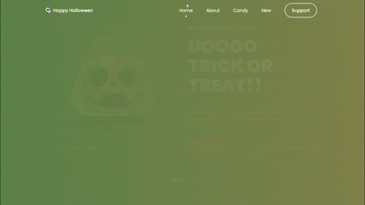
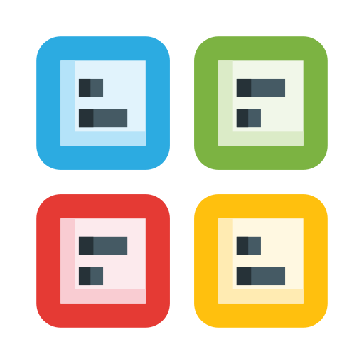
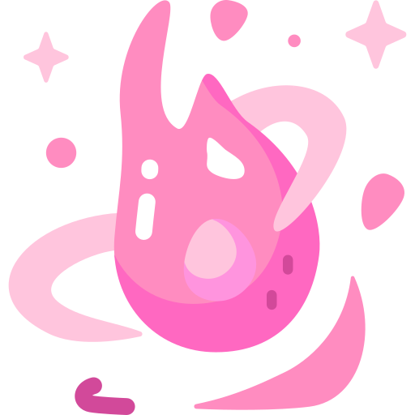

#  Halloween Celebration - Spooky Night 2025

A spooky 👻 and modern 🎃 Halloween-themed celebration website featuring haunted experiences 🦇, scary treats 🍬, and frightening decorations 🕷️.




##  Features

-  **Haunted Home Slider** - Showcase of top scariest ghosts and pumpkins
-  **Category Selection** - Browse ghosts, pumpkins, and witch hats
-  **Trick or Treat Shop** - Halloween candy and accessories
-  **New Arrivals** - Latest spooky products
-  **Newsletter Subscription** - Stay updated with Halloween deals
-  **Responsive Design** - Works perfectly on all devices

##  Quick Start

1. **Clone the repository**
   ```bash
   git clone https://github.com/zxtni/Halloween-NFT.git
   cd Halloween-NFT
   ```

2. **Open in browser**
   ```bash
   # Simply open index.html in your browser
   # Or use a local server
   python -m http.server 8000
   ```

3. **Enjoy the Halloween magic!** 

##  Project Structure

```
Halloween-NFT/
├── index.html             # Main HTML file
├── README.md              # This file
├── assets/
│   ├── css/
│   │   ├── styles.css     # Custom styles and animations
│   │   └── swiper-bundle.min.css
│   ├── js/
│   │   ├── main.js        # Interactive JavaScript
│   │   ├── swiper-bundle.min.js
│   │   └── scrollreveal.min.js
│   └── img/               # Halloween images
│       ├── home1-img.png
│       ├── home2-img.png
│       ├── home3-img.png
│       ├── about-img.png
│       └── ... (more images)
```

##  Technologies Used

- **HTML5** - Semantic structure
- **CSS3** - Advanced animations, gradients, and effects
- **JavaScript ES6+** - Interactive features
- **Swiper.js** - Smooth slider animations
- **ScrollReveal.js** - Scroll animations
- **Boxicons** - Icon library

##  Key Components

### Hero Slider
- 3 spooky character slides
- Smooth swiper animations
- Auto pagination bullets
- Responsive design

### Product Categories
- Ghosts collection
- Pumpkins showcase
- Witch hats gallery
- Hover effects

### Trick or Treat Shop
- 6 Halloween products
- Add to cart functionality
- Price display
- Product categories

### New Arrivals Carousel
- Swipeable product cards
- Discount pricing
- Product images
- Touch support

##  Mobile Support

- Responsive design for all screen sizes
- Touch-friendly interactions
- Mobile menu toggle
- Optimized performance

##  Browser Support

-  Chrome 80+
-  Firefox 75+
-  Safari 13+
-  Edge 80+

##  License

This project is open source and available under the [MIT License](LICENSE).

© 2025 Zxtni - All rights reserved

##  Acknowledgments

- **Halloween Traditions** - Inspired by spooky celebrations
- **Swiper.js** - Smooth slider library
- **ScrollReveal.js** - Amazing scroll animations
- **Boxicons** - Beautiful icon library

##  Support & Contact

 **GitHub:** [github.com/zxtni](https://github.com/zxtni)  
 **Instagram:** [@igofrahul](https://www.instagram.com/igofrahul)  
 **Twitter:** [@zxtni](https://twitter.com/zxtni)  
 **Telegram:** [@zxtni](https://t.me/zxtni)

---

<div align="center">

**Made with  for Halloween 2025**

**Created by Rahul - Zxtni Brand**


</div>

